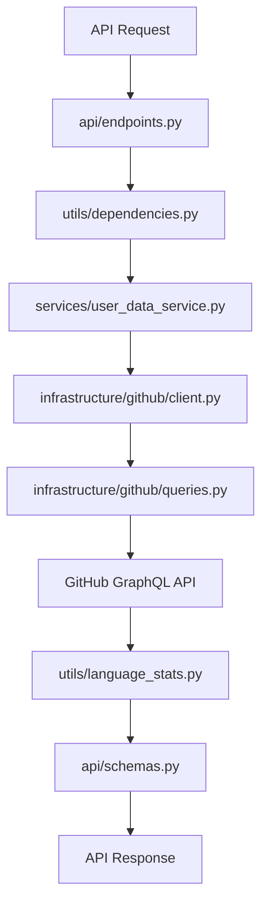

# Git Gud Stats - Backend App

<p align="center">
  <a href="https://fastapi.tiangolo.com/"></a>
  <a href="https://www.python.org/"></a>
  <a href="https://pypi.org/project/pydantic/"></a>
  <a href="https://graphql.org/"></a>
</p>

## Purpose

This folder contains the backend logic for the **Git Gud Stats** project, built with **FastAPI**. It provides endpoints to fetch and process GitHub user statistics using both REST and GraphQL APIs.

## Architecture Overview

### Core Files

- **`main.py`** - Application entry point. Runs the FastAPI app created in `app.__init__.py`
- **`__init__.py`** - App factory (`create_app`) that sets up FastAPI, CORS, OAuth, and includes API routers
- **`settings.py`** - Loads configuration and secrets from environment variables using Pydantic Settings

## Directory Structure

```
app/
├── main.py                          # Application entry point
├── __init__.py                      # App factory (create_app)
├── settings.py                      # Configuration and environment variables
│
├── api/
│   ├── __init__.py                  # Package marker
│   ├── endpoints.py                 # API routes for user stats and debugging
│   ├── schemas.py                   # Pydantic models for request/response validation
│   └── auth.py                      # Authentication logic (reserved)
│
├── infrastructure/
│   ├── __init__.py                  # Package marker
│   ├── github/
│   │   ├── __init__.py              # Package marker
│   │   ├── client.py                # Async client for GitHub GraphQL API
│   │   └── queries.py               # GraphQL queries for user data
│   └── email/                       # Email integration (reserved)
│
├── routers/
│   └── __init__.py                  # Additional routers (reserved)
│
├── services/
│   ├── __init__.py                  # Package marker
│   └── user_data_service.py         # Service for fetching and processing user data
│
└── utils/
    ├── __init__.py                  # Package marker
    ├── language_stats.py            # Functions for processing language statistics
    └── dependencies.py              # Helpers for authentication and request headers
```

## Layer Descriptions

### 🔌 **API Layer** (`api/`)
- **`endpoints.py`** - Defines REST API routes for user statistics and debugging
- **`schemas.py`** - Pydantic models for request/response validation
- **`auth.py`** - Authentication logic (reserved for future implementation)

### 🏗️ **Infrastructure Layer** (`infrastructure/`)
- **`github/client.py`** - Async client for GitHub GraphQL API interactions
- **`github/queries.py`** - GraphQL query definitions for user data fetching
- **`email/`** - Email integration services (reserved)

### 🛠️ **Services Layer** (`services/`)
- **`user_data_service.py`** - Business logic for fetching and processing GitHub user data

### 🧰 **Utils Layer** (`utils/`)
- **`language_stats.py`** - Helper functions for processing programming language statistics
- **`dependencies.py`** - Common dependencies for authentication and request headers

### 🚦 **Routers Layer** (`routers/`)
- Reserved for additional API routers and route organization

## Data Flow



1. **Request** arrives at an API endpoint in `api/endpoints.py`
2. **Authentication** and headers are handled by `utils/dependencies.py`
3. **Data fetching** from GitHub is performed by `infrastructure/github/client.py` and processed by `services/user_data_service.py`
4. **Language processing** is handled by `utils/language_stats.py`
5. **Response** is validated and serialized using models in `api/schemas.py`

## Key Features

- ✅ **Modular Architecture** - Clean separation of concerns
- ✅ **Async Support** - Non-blocking I/O operations
- ✅ **Type Safety** - Pydantic models for data validation
- ✅ **GraphQL Integration** - Efficient GitHub API queries
- ✅ **Extensible Design** - Easy to add new features and integrations

---

This modular structure makes the codebase **maintainable**, **testable**, and **easy to extend**.